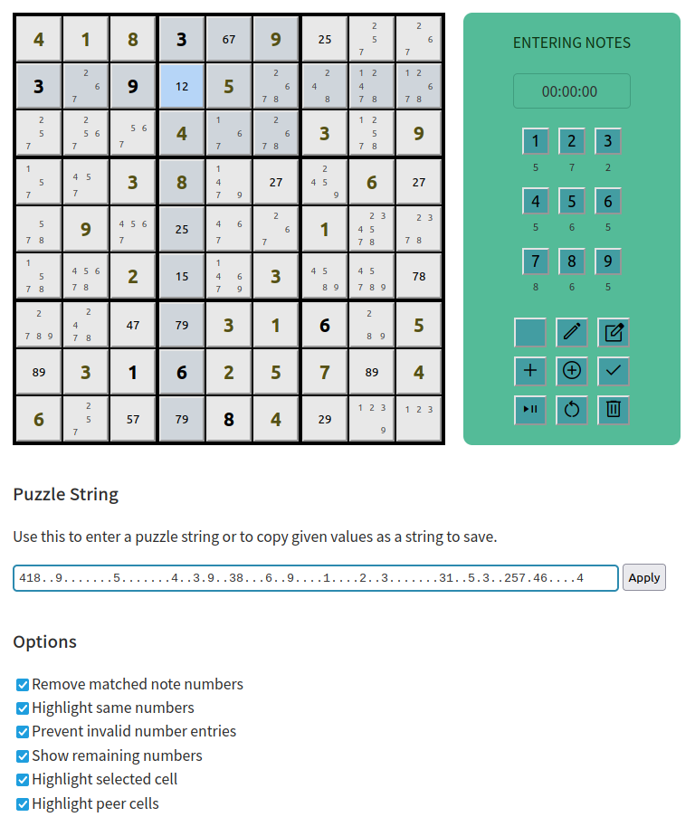

# Sudoku Assistant coded using VueJS



This template should help get you started developing with Vue 3 in Vite.

The Vue coding style used here is the *Options* style rather than *Composition*. If I re-write this code or develop it further, I will use the *Composition* style.

## Recommended IDE Setup

[VSCode](https://code.visualstudio.com/) + [Volar](https://marketplace.visualstudio.com/items?itemName=Vue.volar) (and disable Vetur) + [TypeScript Vue Plugin (Volar)](https://marketplace.visualstudio.com/items?itemName=Vue.vscode-typescript-vue-plugin).

## Customize configuration

See [Vite Configuration Reference](https://vitejs.dev/config/).

## Project Setup

```sh
npm install
```

### Compile and Hot-Reload for Development

```sh
npm run dev
```

### Compile and Minify for Production

```sh
npm run build
```

## Links

https://www.stolaf.edu/people/hansonr/sudoku/explain.htm#almost

https://www.sudokuwiki.org/sudoku.htm

...52.1..54....67......4...3..741..6.........1..39...2...9......69....38..4.58

